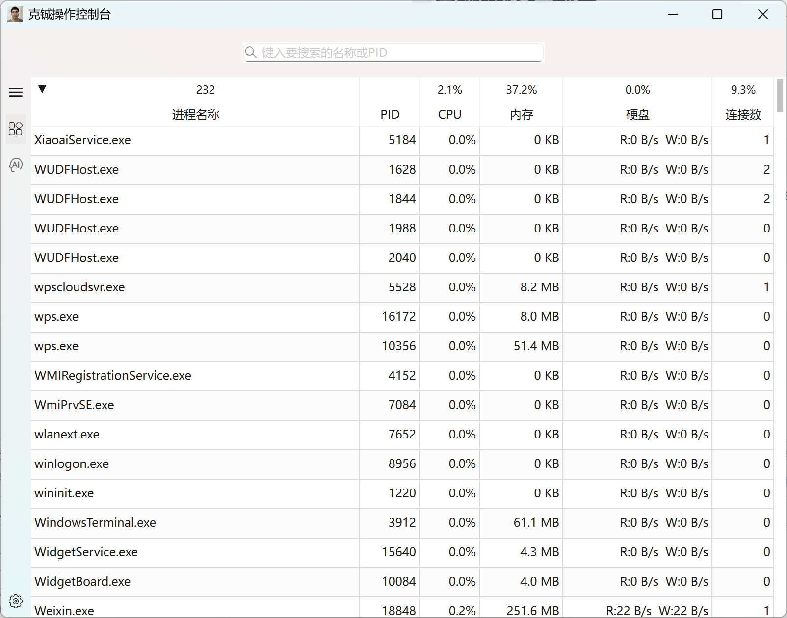
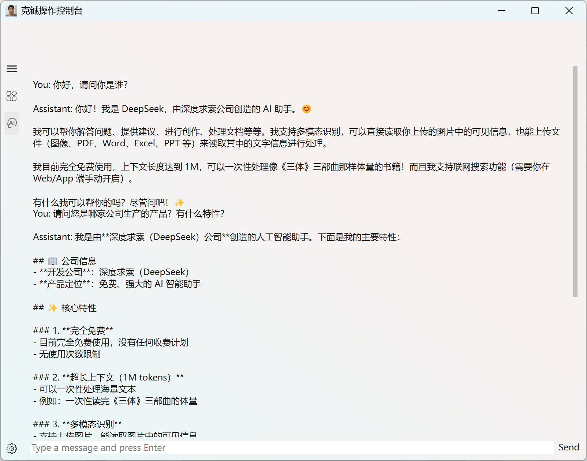

# 克铖操作控制台

打造一款轻量、现代、高效的 Windows 系统监控与操作工具。

## 目标用户群体

硬件爱好者，软件发烧友，操作系统极客

### 核心定位

实时系统性能监控 + 进程/服务/启动项管理 + 简单AI问答

### 使用方法

Windows中增加一个环境变量：DEEPSEEK_API_KEY ，值设置为你的sk-*************************

### 运行效果截图

